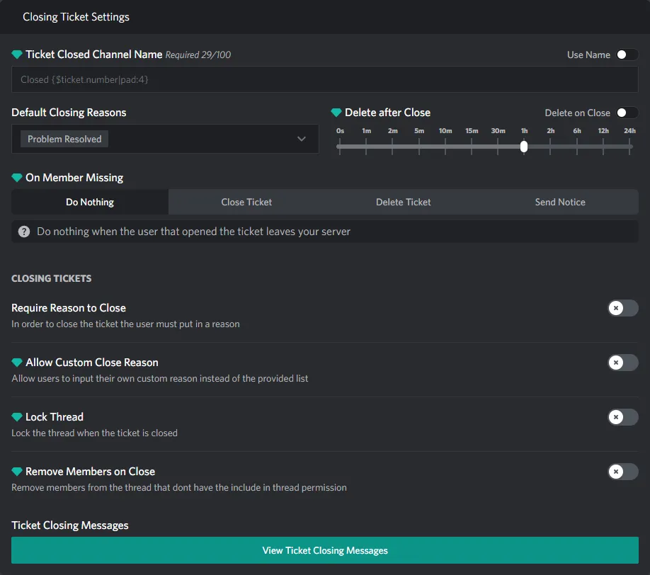
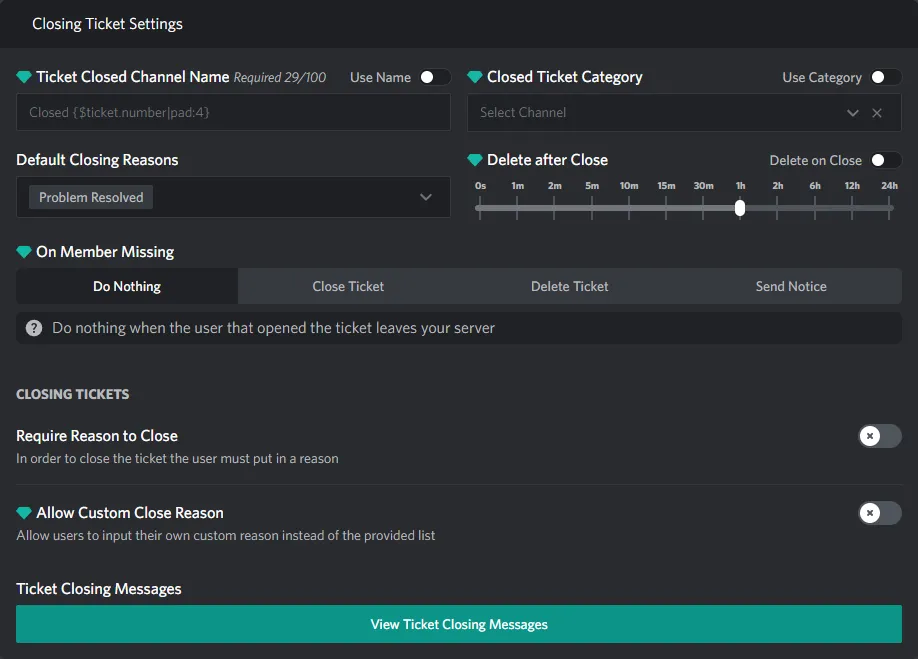

# Closing Ticket Section

::: info
This documentation is currently going through an overhaul, some information may be missing or incomplete!
:::

## Thread Settings

  

These are all the settings that are only available to thread tickets

### Lock Thread

> TODO

## Channel Settings

  

These are all the settings that are only available to channel tickets

### Closed Category

> TODO

## Shared Settings

> TODO

### Ticket Closed Channel Name

> TODO

### Default Closing Reasons

> TODO

### Delete after Close

> TODO

### On Member Missing

> TODO

### Require Reason to Close

> TODO

### Allow Custom Close Reason

> TODO

### Remove Members on Close

> TODO

### Ticket Closing Messages

> TODO
