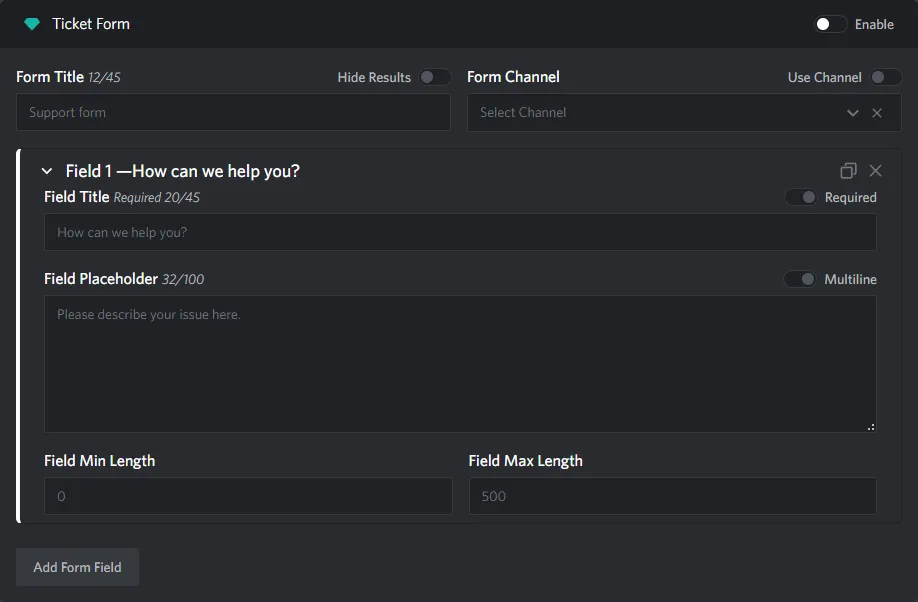
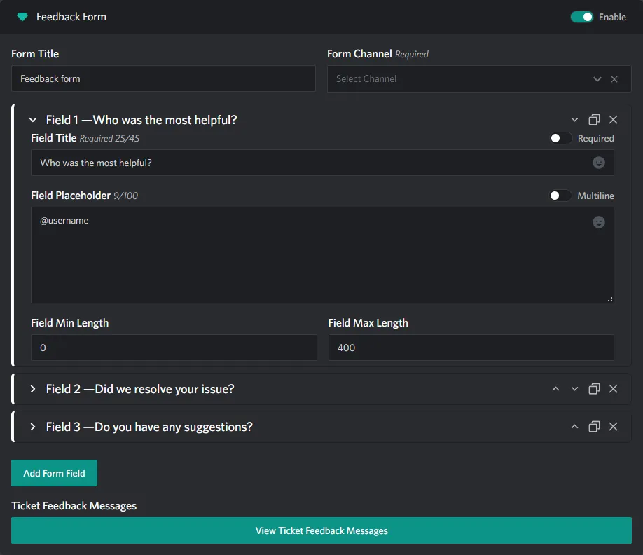

# Ticket Form & Feedback Form Section

::: info
This documentation is currently going through an overhaul, some information may be missing or incomplete!
:::

:::tabs

== Form

  

== Feedback Form

  

:::

## Form Title

> TODO

## Form Channel

> TODO

## Form Field

> TODO

### Field Title

> TODO

### Field Placeholder

> TODO

### Field Min Length

> TODO

### Field Max Length

> TODO

### Required Fields

> TODO

### Multiline Fields

> TODO

### Ticket Feedback Messages

> TODO
