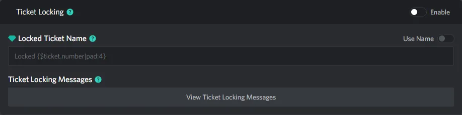
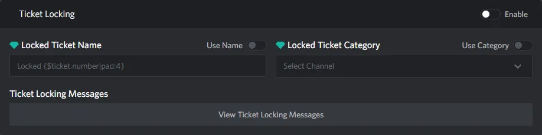

# Ticket Locking Section

::: info
This documentation is currently going through an overhaul, some information may be missing or incomplete!
:::

## Thread Settings

  

> These are no thread specific settings for ticket locking

## Channel Settings

  

These are all the settings that are only available to channel tickets

### Locked Ticket Category

> TODO

## Shared Settings

### Locked Ticket Name

> TODO

### Ticket Locking Messages

> TODO
