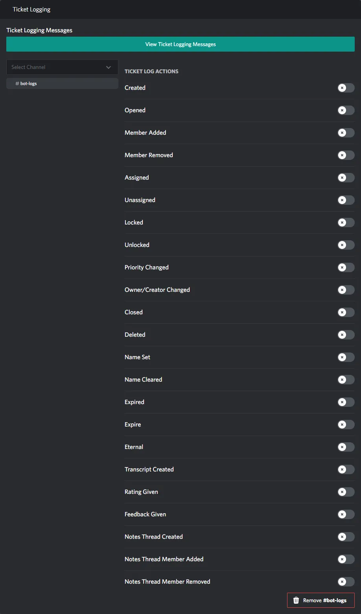

# Ticket Logging Section

::: info
This documentation is currently going through an overhaul, some information may be missing or incomplete!
:::

  

## Ticket Log Actions

### Created

> TODO

### Opened

> TODO

### Member Added

> TODO

### Member Removed

> TODO

### Assigned

> TODO

### Unassigned

> TODO

### Locked

> TODO

### Unlocked

> TODO

### Priority Changed

> TODO

### Owner/Creator Changed

> TODO

### Closed

> TODO

### Deleted

> TODO

### Name Set

> TODO

### Name Cleared

> TODO

### Expired

> TODO

### Expire

> TODO

### Eternal

> TODO

### Transcript Created

> TODO

### Rating Given

> TODO

### Feedback Given

> TODO

### Notes Thread Created

> TODO

### Notes Thread Member Added

> TODO

### Notes Thread Member Removed

> TODO

## Ticket Logging Messages

> TODO
