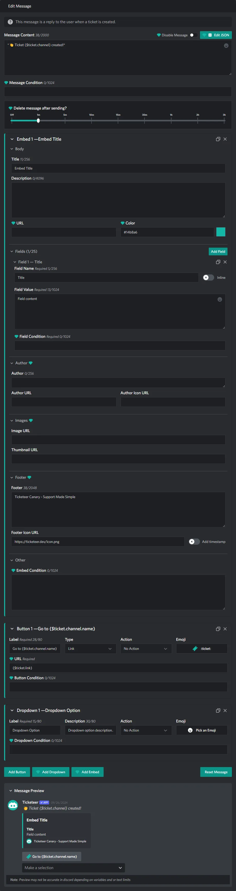

# Ticket Message Editor

::: info
This documentation is currently going through an overhaul, some information may be missing or incomplete!
:::

  

## Reset Message

> TODO

## Delete message after sending

> TODO

## Disabling Message

> TODO

## Message Content

> TODO

## Message Condition

> TODO

## Code Editor

> TODO

## Message Embeds

### Embed Body

> TODO

### Embed Fields

> TODO

### Embed Author

> TODO

### Embed Images

> TODO

### Embed Footer

> TODO

### Embed Condition

> TODO

## Message Buttons

### Button Label

> TODO

### Button Type

> TODO

### Button Link

> TODO

### Button Action

> TODO

### Button Emoji

> TODO

### Button URL

> TODO

### Button Condition

> TODO

## Message Dropdown

### Dropdown Label

> TODO

### Dropdown Description

> TODO

### Dropdown Action

> TODO

### Dropdown Emoji

> TODO

### Dropdown Condition

> TODO

## Actions

> TODO
