# Open Ticket Section

## Thread Settings

  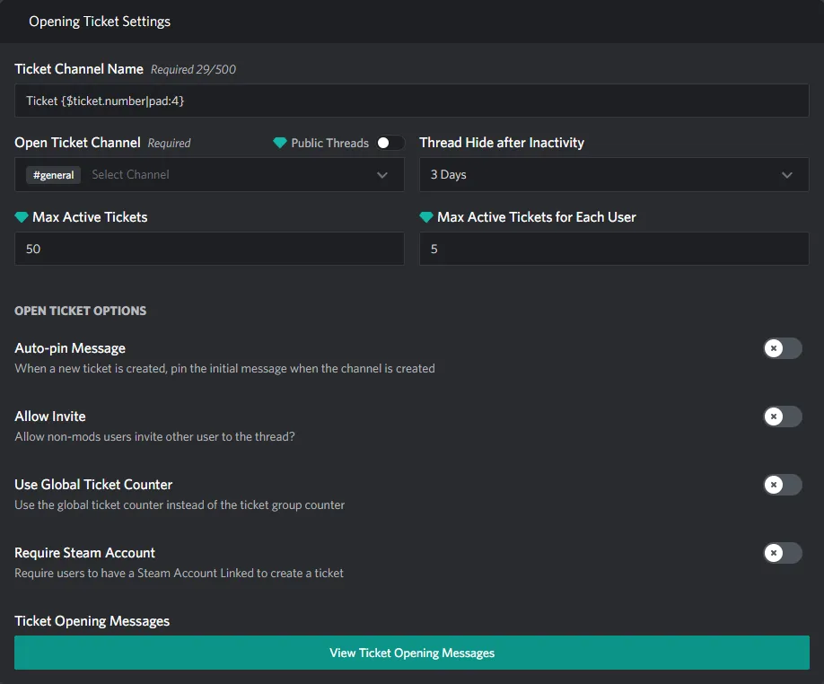

These are all the settings that are only available to thread tickets

### Public Threads

  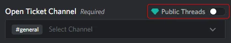

If toggled on this will create public threads instead of private threads when someone opens a ticket

### Thread Hide after Inactivity

  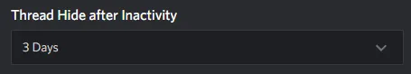

This will set the "Hide after Inactivity" setting in discord that is available to threads.

  

## Channel Settings

  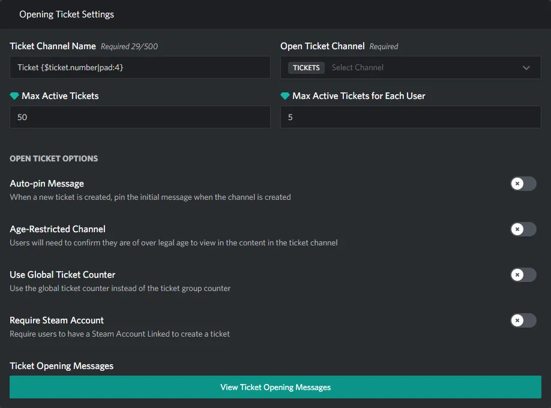

These are all the settings that are only available to channel tickets

### Age-Restricted Channel

  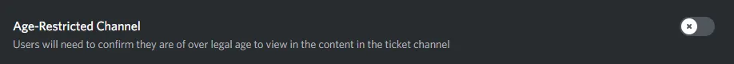

This will set the "Age-Restricted Channel" setting in discord that is available to channels.

  

## Shared Settings

### Ticket Channel Name

  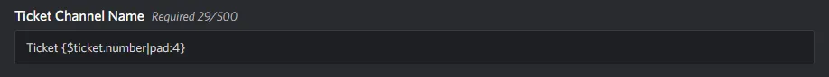

The ticket channel name is the name you see on discord when a ticket is opened, you can use template variables in the name like this `{$ticket.number|pad:4}` to see a complete list of variables, see [the Messages section](/messages#object-types)

### Open Ticket Channel

  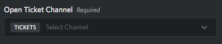

This is where the tickets will go under, if you pick a text channel for the "Open Ticket Channel" it will create a thread thread under that channel. If you pic a category channel, when a new ticket is created it will create a new channel ticket under that category.

### Max Active Tickets

  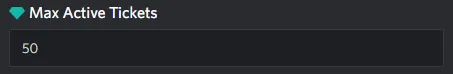

This is the maximum allowed tickets to be open throughout the whole ticket group.

### Max Active Tickets for Each User

  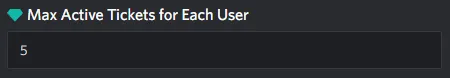

This is the maximum allowed tickets to be open for each user for the given ticket group.

### Auto-pin Message

  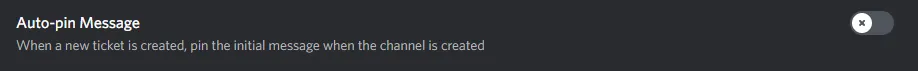

This will pin the welcome message when the ticket is created.

### Use Global Ticket Counter

  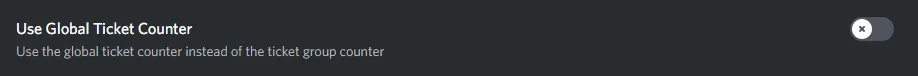

When a ticket is created it will use a global (server) ticket counter instead of using the counter for the ticket group.

### Require Steam Account

  

When this is enabled, in order for a user to create a ticket they must link their steam account to Ticketeer. This verifies a user's steam profile is correct.

### Ticket Opening Messages

  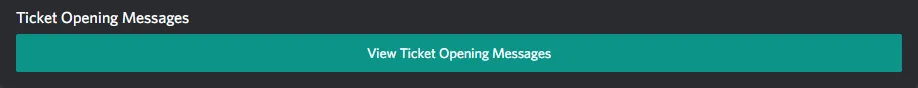

This is a button that will open a collection of messages for ease of access, [you can view these messages here](/messages#opening-messages).
