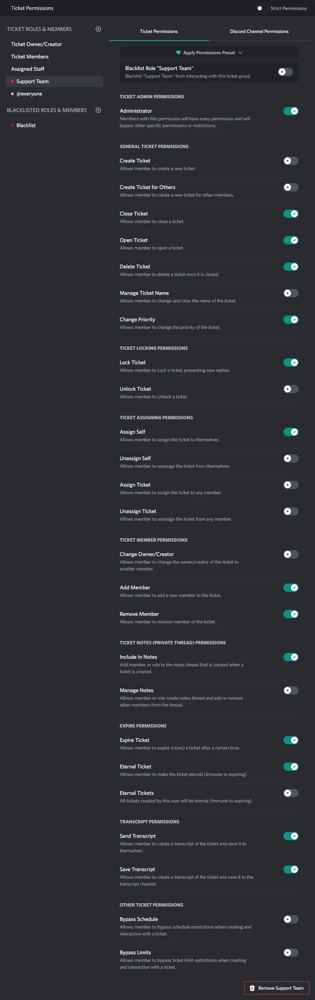
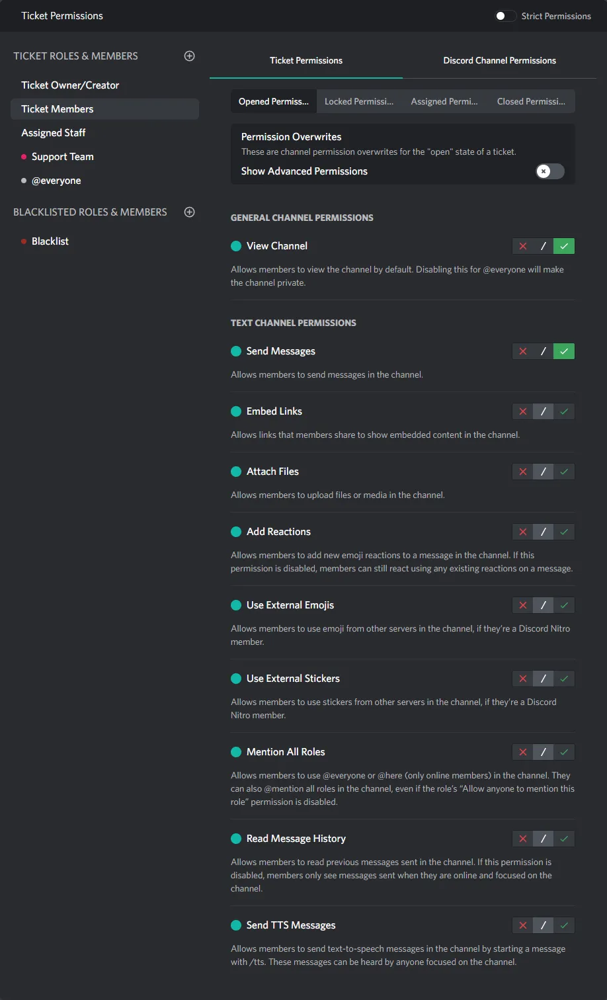

# Ticket Permissions Section

::: info
This documentation is currently going through an overhaul, some information may be missing or incomplete!
:::

:::tabs

== Ticket Permissions

  

== Channel Permissions

  

:::

## Strict Permissions

> TODO

## Adding Roles & Users

> TODO

## Permission Presets

> TODO

## Blacklisting

> TODO

## Special Roles

### Ticket Owner

> TODO

### Ticket Members

> TODO

### Assigned Staff

> TODO

### @everyone

> TODO

## Channel Permissions

### Channel Permission States

> TODO

### Advanced Permissions

> TODO

## Ticket Permissions

> TODO

### General Ticket Permissions

#### Create Ticket

Allows member to create a new ticket.

#### Create Ticket for Others

Allows member to create a new ticket for other members.

#### Close Ticket

Allows member to close a ticket.

#### Open Ticket

Allows member to open a ticket.

#### Delete Ticket

Allows member to delete a ticket once it is closed.

#### Manage Ticket Name

Allows member to change and clear the name of the ticket.

#### Change Priority

Allows member to change the priority of the ticket.

#### Ticket Locking Permissions

#### Lock Ticket

Allows member to Lock a ticket, preventing new replies.

#### Unlock Ticket

Allows member to Unlock a ticket.

### Ticket Assigning Permissions

#### Assign Self

Allows member to assign the ticket to themselves.

#### Unassign Self

Allows member to unassign the ticket from themselves.

#### Assign Ticket

Allows member to assign the ticket to any member.

#### Unassign Ticket

Allows member to unassign the ticket from any member.

### Ticket Member Permissions

#### Change Owner/Creator

Allows member to change the owner/creator of the ticket to another member.

#### Add Member

Allows member to add a new member to the ticket.

#### Remove Member

Allows member to remove member of the ticket.

### Ticket Notes (Private Thread) Permissions

#### Include In Thread

Prevents member or role from being removed from a ticket when it is closed.

### Expire Permissions

#### Expire Ticket

Allows member to expire (close) a ticket after a certain time.

#### Eternal Ticket

Allows member to make the ticket eternal (Immune to expiring).

#### Eternal Tickets

All tickets created by this user will be eternal (Immune to expiring).

### Transcript Permissions

#### Send Transcript

Allows member to create a transcript of the ticket and send it to themselves.

#### Save Transcript

Allows member to create a transcript of the ticket and save it to the transcript channel.

### Other Ticket Permissions

#### Bypass Schedule

Allows member to bypass schedule restrictions when creating and interaction with a ticket.

#### Bypass Limits

Allows member to bypass ticket limit restrictions when creating and interaction with a ticket.
